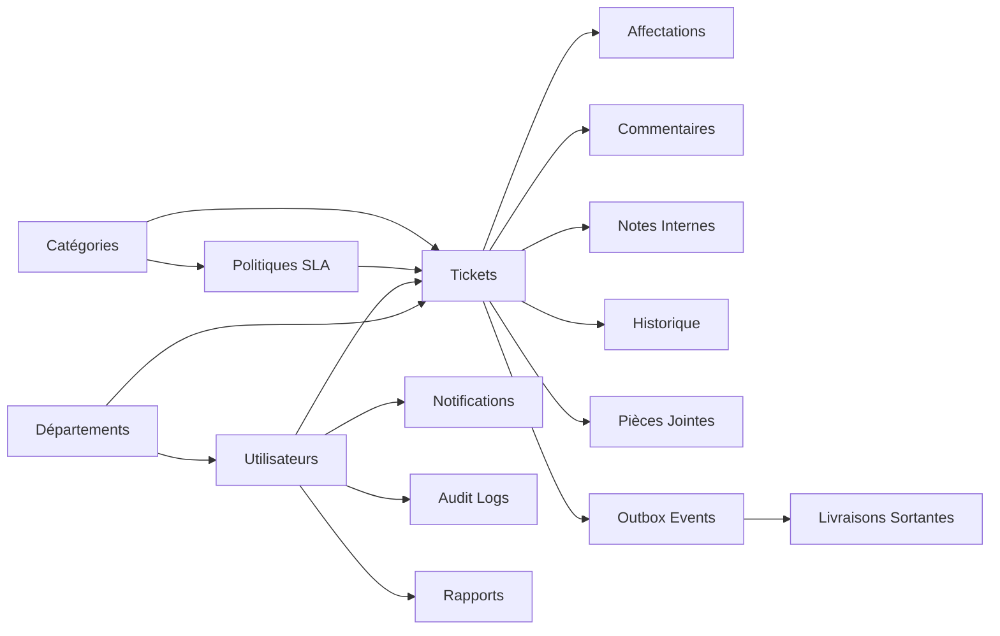

# 📡 Telecom Ticket Management — Backend API


Backend **NestJS** pour la plateforme de gestion des tickets d'incidents télécoms.
Utilisé par le Service Client, NOC, Facturation, Support Technique et Opérations Terrain.

---

## 📋 Table des matières

- [Prérequis](#-prérequis)
- [Démarrage Rapide](#-démarrage-rapide)
- [Comptes de Test](#-comptes-de-test-complet)
- [Architecture](#️-architecture)
- [Modules](#-modules-25)
- [Flux Asynchrone](#-flux-asynchrone-bullmq)
- [Sécurité](#️-sécurité)
- [Observabilité](#-observabilité)
- [Docker Compose](#-docker-compose-15-services)
- [Frontend (2 dépôts)](#-frontend-2-dépôts)
- [Scripts & Makefile](#-scripts--makefile)
- [Troubleshooting](#-troubleshooting)
- [Documentation Index](#-documentation)

---

## ✅ Prérequis

| Outil       | Version minimale | Vérification             |
| ----------- | ---------------- | ------------------------ |
| **Node.js** | ≥ 18.x           | `node -v`                |
| **pnpm**    | ≥ 8.x            | `pnpm -v`                |
| **Docker**  | ≥ 24.x           | `docker -v`              |
| **Compose** | ≥ 2.20           | `docker compose version` |

> ⚠️ **Toujours utiliser `pnpm`**, pas `npm` ni `yarn`.

---

## 🚀 Démarrage Rapide

### Étape 1 — Cloner et installer

```bash
git clone <url-du-repo>
cd Test-Backend-Telecom
pnpm install
```

### Étape 2 — Configurer l'environnement

```bash
# Copier le fichier d'exemple
cp .env.example .env
```

### Étape 3 — Démarrer les services Docker (PostgreSQL, Redis, Mailpit, Keycloak)

```bash
docker compose up -d postgres redis mailpit keycloak
```

### Étape 4 — Initialiser la base de données et Keycloak

```bash
# Pousser le schéma Drizzle + insérer les données de test PostgreSQL
pnpm run db:push && pnpm run db:seed

# Peupler 105 comptes dans le realm Keycloak
node keycloak/seed-users.mjs
```

### Étape 5 — Lancer l'API

```bash
pnpm run start:dev
```

✅ API accessible sur `http://localhost:3000/api/v1`
✅ Swagger sur `http://localhost:3000/api/docs`

### Tests

```bash
# Tests unitaires (89 fichiers spec / 584 tests réussis)
pnpm run test:unit

# Tests end-to-end et intégration (20 fichiers)
pnpm run test:e2e

# Tous les tests (109 fichiers)
pnpm run test:all
```

---

## 📊 Comptes de Test (complet)

> Tous les comptes PostgreSQL sont créés par `pnpm run db:seed`. Les comptes SSO Keycloak sont créés par `node keycloak/seed-users.mjs`.

### Authentification — Keycloak SSO (unique)

Keycloak est l'**unique fournisseur d'authentification** (frontend et API). La connexion se fait via le SSO du frontend interne (`http://localhost:3007`) ou via OAuth2 PKCE. L'API vérifie les jetons Keycloak (RS256) via JWKS.

```bash
curl http://localhost:3000/api/v1/users \
  -H "Authorization: Bearer <accessToken Keycloak>"
```

### Comptes SSO Keycloak (105 comptes)

> Keycloak tourne sur **http://localhost:8081** (realm `telecom`).

| Usage                       | Identifiant                                         | Mot de passe    |
| --------------------------- | --------------------------------------------------- | --------------- |
| Login SSO — Administrateur  | `admin@telecom.local`                               | `Admin@1234`    |
| Login SSO — Superviseur     | `supervisor@telecom.local`                          | `Super@1234`    |
| Login SSO — 105 agents seed | `agent.<ROLE>.<1..15>@telecom.local` (7 rôles × 15) | `Telecom@2026!` |
| Console admin Keycloak      | `admin`                                             | `Admin@1234`    |

### Outils de monitoring

| URL                                         | Service        | Identifiants                                                               |
| ------------------------------------------- | -------------- | -------------------------------------------------------------------------- |
| `http://localhost:3000/api/v1`              | API REST       | Bearer token Keycloak (RS256)                                              |
| `http://localhost:3000/api/docs`            | Swagger UI     | Aucun                                                                      |
| `http://localhost:3000/api/v1/admin/queues` | BullBoard      | `admin`/`bullboard` (prod : `BULLBOARD_USER/PASSWORD` + `timingSafeEqual`) |
| `http://localhost:8025`                     | Mailpit (SMTP) | Aucun                                                                      |
| `http://localhost:3001`                     | Grafana        | `admin`/`admin`                                                            |
| `http://localhost:8081/admin`               | Keycloak Admin | `admin`/`Admin@1234`                                                       |
| `http://localhost:9090`                     | Prometheus     | Aucun                                                                      |
| `http://localhost:3002`                     | Uptime Kuma    | Premier démarrage (création compte)                                        |

---

## 🏗️ Architecture

```
25 modules NestJS · 31 tables PostgreSQL · 139 opérations OpenAPI (115 chemins) · 8 workers BullMQ · 8 queues · 15 templates email
```

### Schéma Entité-Relation (ERD Simplifié)



---

## 📦 Modules (25)

| Module                 | Responsabilité                                                                                                                                  |
| ---------------------- | ----------------------------------------------------------------------------------------------------------------------------------------------- |
| `auth`                 | Keycloak SSO (RS256/JWKS), profil de session `GET /auth/me`                                                                                     |
| `users`                | CRUD 7 rôles, activation/désactivation, provisionnement Keycloak, pause/reprise/absence                                                         |
| `departments`          | 6 départements télécom, soft delete, auto-assignation, pondérations                                                                             |
| `categories`           | Catégories d'incidents avec `targetRole` dynamique                                                                                              |
| `tickets`              | State machine 9 statuts + 2 attente, ownership-based RBAC/ABAC, `INC-AAAA-NNNNNN`, auto-clôture 48h                                             |
| `comments`             | Commentaires publics, réponse au demandeur, corrections liées                                                                                   |
| `internal-notes`       | Notes internes (interdites aux `FIELD_TECHNICIAN`)                                                                                              |
| `attachments`          | Upload/download streaming, quarantaine, inspection MIME, scan ClamAV                                                                            |
| `notifications`        | Inbox pattern, WebSocket temps réel                                                                                                             |
| `sla`                  | Politiques SLA, cron `*/5 min`, détection warning/breach, pause SLA                                                                             |
| `dashboard`            | 10 endpoints : overview, statuts, priorités, départements, SLA, workload, temps de résolution, performance agents, mon activité, support public |
| `audit-logs`           | Immutable write-only, recherche multi-filtres                                                                                                   |
| `email`                | Nodemailer dev/prod, 15 templates Handlebars + `base.hbs` layout                                                                                |
| `reports`              | Génération PDF (PDFKit), asynchrone, lien signé HMAC expirable (2j), retry finalAttempt BullMQ                                                  |
| `settings`             | Paramètres système globaux dynamiques (heures/jours ouvrables, limite de tickets)                                                               |
| `support-satisfaction` | Note 1-5, lien signé unique (TTL 14 j), email automatique à la clôture                                                                          |
| `public-support`       | Portail public : catalogue, conversations (brouillon → confirmation), timeline, préférences                                                     |
| `external-identity`    | Identité publique : OTP email, appareils de confiance (90j), assertions WordPress                                                               |
| `support-integrations` | Tenants multi-sites : origines, routage, quotas, secrets chiffrés AES-GCM                                                                       |
| `external-requesters`  | Demandeurs publics : fusion de profils, anonymisation RGPD, rétention                                                                           |
| `support-knowledge`    | Base documentaire publique versionnée, cloisonnée par intégration                                                                               |
| `support-bot`          | Assistant conversationnel optionnel (budget, circuit breaker, outils fermés, repli formulaire)                                                  |
| `outbox`               | Boîte d'envoi fiable : événements transactionnels dépilés chaque seconde                                                                        |
| `external-delivery`    | Livraisons sortantes : adaptateur email, statuts `DELIVERY_UNKNOWN` rejoué après 30min, rejeu 7j + `POST :id/retry` manuel                      |
| `app`                  | Module racine, health checks, métriques Prometheus                                                                                              |

---

## 🔄 Flux Asynchrone & Outbox (BullMQ)

```
Ticket créé → TicketNotificationListener (@OnEvent)
  ├── EMAIL_QUEUE        → EmailWorker       → SMTP Mailpit (confirmation, assignation, alerte)
  ├── NOTIFICATION_QUEUE → NotificationWorker → DB + WebSocket emit
  ├── AUDIT_QUEUE        → AuditWorker       → INSERT audit_logs
  └── SLA_QUEUE          → SlaWorker         → Vérification breach SLA

Événement outbox (support public) → OutboxPublisherService (@Interval 1 s)
  ├── external-delivery-queue → ExternalDeliveryWorker → EmailChannelAdapter
  └── attachment-scan-queue → AttachmentScanWorker → ClamAV (3310) → storage/clean/

SlaEngineService (@Cron */5 min)
  ├── DB update (slaBreached = true)
  ├── WebSocket emit (supervisor + assigné)
  └── EMAIL_QUEUE → EmailWorker → Alerte SLA
```

---

## 🛡️ Sécurité

- **Auth** : Keycloak SSO unique (OIDC PKCE, RS256/JWKS), `email_verified===true` strict, révocation Redis `jwt_bl/jwt_user_bl` fail-closed en prod
- **RBAC** : 7 rôles, `JwtAuthGuard` + `RolesGuard` + `@Roles()`, SUPERVISOR ne peut modifier ADMIN/SUPERVISOR cible, anti self-disable/last ADMIN
- **ABAC** : Cloisonnement départemental (agents/superviseurs voient uniquement leur département) + `users.findOne` filtré
- **Rate Limiting** : Redis distribué (1000 req/15min, 20 tentatives/heure sur OTP et assertions), repli mémoire sans fail-open silencieux
- **Idempotence** : `@Idempotent()` + header `Idempotency-Key` (table `idempotency_records` TTL 24h, purge cron `retention-cleanup`, plus de `DELETE` hot path)
- **Soft Delete** : `users` partiel `WHERE deleted_at IS NULL` + `DELETE` physique sur échec Keycloak (email recréable), `tickets/departments` soft delete
- **Headers** : `X-Correlation-Id` borné `^[A-Za-z0-9._-]{1,64}$`, `Cache-Control: private, no-store` sur downloads, `X-Content-Type-Options: nosniff`

---

## 📈 Observabilité

```
NestJS (Pino JSON)
  ├── Logs  → Promtail → Loki → Grafana (:3001)
  ├── /metrics → Prometheus (:9090) → Grafana → Uptime Kuma (:3002)
  └── Traces → OpenTelemetry → Tempo (:3200) → Grafana
```

---

## 🐳 Docker Compose (15 services)

```bash
# Services essentiels seulement
docker compose up -d postgres redis mailpit keycloak

# Tout démarrer (monitoring inclus)
make up-full
```

| Service        | Port       | Description                     |
| -------------- | ---------- | ------------------------------- |
| API NestJS     | 3000       | Backend REST API                |
| Frontend (BFF) | 3007       | Console opérationnelle interne  |
| Portail Public | 3005       | Portail & Widget support client |
| PostgreSQL 16  | 5432       | Base de données                 |
| Redis 7        | 6379       | Cache + sessions + queues       |
| Nginx          | 80, 443    | Reverse proxy                   |
| Mailpit        | 1025, 8025 | SMTP de test (dev)              |
| Prometheus     | 9090       | Métriques                       |
| Grafana        | 3001       | Visualisation & Dashboards      |
| Loki           | 3100       | Agrégation logs                 |
| Tempo          | 3200       | Tracing distribué               |
| Promtail       | 9080       | Collecteur logs                 |
| Uptime Kuma    | 3002       | Monitoring uptime               |
| ClamAV         | 3310       | Antivirus pièces jointes        |
| Keycloak       | 8081       | SSO Keycloak (8080 réservé)     |

---

## 🖥️ Frontends (2 dépôts)

### 1. Frontend Embarqué (`./frontend/`)

Console opérationnelle interne. BFF (Next.js 16, React 19) avec cookies HttpOnly et SSO Keycloak. Port : `http://localhost:3007`.

### 2. Portail public + widget (`public-frontend/`)

Portail pleine page et widget iframe pour les clients externes. BFF même origine, session publique JWT, OTP et assertions WP. Port : `http://localhost:3005`.

---

## 📋 Scripts & Makefile

### Commandes Makefile Principales

| Commande             | Description                                      |
| -------------------- | ------------------------------------------------ |
| `make up`            | Démarrer tous les services Docker                |
| `make down`          | Arrêter la stack                                 |
| `make db-push`       | Pousser le schéma Drizzle                        |
| `make db-seed`       | Charger les données de démo PostgreSQL           |
| `make keycloak-seed` | Crée 105 comptes dans Keycloak (realm telecom)   |
| `make accounts`      | Affiche les comptes de démonstration             |
| `make test`          | Lancer tous les tests backend (`pnpm test:all`)  |
| `make openapi`       | Exporter les contrats OpenAPI (interne + public) |
| `make lint`          | ESLint avec correction automatique               |
| `make typecheck`     | Vérification TypeScript stricte                  |

---

## 🔧 Troubleshooting

```bash
# Réinitialiser complètement la base et re-seeder
make db-reset
make keycloak-seed
```

---

## 📚 Documentation

| Fichier                                                                          | Contenu                                                                                          |
| -------------------------------------------------------------------------------- | ------------------------------------------------------------------------------------------------ |
| [CHANGELOG.md](CHANGELOG.md)                                                     | Historique complet des versions et corrections (v1.0.0 → 2026-08-14)                             |
| [CONTRIBUTING.md](CONTRIBUTING.md)                                               | Guide de contribution et normes Git                                                              |
| [docs/quick-start.md](docs/quick-start.md)                                       | Guide de démarrage rapide en 5 minutes                                                           |
| [docs/routes.md](docs/routes.md)                                                 | Catalogue des 139 opérations OpenAPI (115 chemins)                                               |
| [docs/architecture-flows.md](docs/architecture-flows.md)                         | 14 diagrammes Mermaid (SSO Keycloak, Outbox, ClamAV, Bot, Pipeline HTTP, Observabilité)          |
| [docs/database-schema.md](docs/database-schema.md)                               | Schéma de base de données PostgreSQL (31 tables, index, contraintes SQL)                         |
| [docs/ticket-lifecycle.md](docs/ticket-lifecycle.md)                             | Machine à états des tickets (9 statuts + 2 attentes, règles de transition)                       |
| [docs/domain-events.md](docs/domain-events.md)                                   | Moteur d'événements EventEmitter2 + Outbox transactionnelle durable (`outbox_events`)            |
| [docs/security.md](docs/security.md)                                             | Architecture de sécurité (SSO Keycloak RS256/JWKS, RBAC/ABAC, Rate limiting, Quarantaine ClamAV) |
| [docs/auth-guide.md](docs/auth-guide.md)                                         | Guide complet de l'authentification SSO Keycloak (PKCE, JWKS, profil métier, déconnexion)        |
| [docs/test-accounts.md](docs/test-accounts.md)                                   | Inventaire des comptes de test (14 utilisateurs PostgreSQL + 105 comptes SSO Keycloak)           |
| [docs/testing.md](docs/testing.md)                                               | Guide des tests (89 fichiers spec unitaires / 582 tests réussis + 20 fichiers e2e)               |
| [docs/environment-variables.md](docs/environment-variables.md)                   | Référence des 147 variables d'environnement documentées dans `.env.example`                      |
| [docs/deployment.md](docs/deployment.md)                                         | Guide de déploiement production, SSL, scaling horizontal et checklist                            |
| [docs/emails.md](docs/emails.md)                                                 | Architecture email, Nodemailer, SMTP/Mailpit, 15 templates Handlebars (`base.hbs`)               |
| [docs/observability.md](docs/observability.md)                                   | Stack d'observabilité (Prometheus, Loki, Tempo, Grafana, Alertmanager, Uptime Kuma)              |
| [docs/websockets.md](docs/websockets.md)                                         | WebSockets temps réel (namespaces `/ws` et `/public-support`, rooms, scaling Redis)              |
| [docs/jobs-and-workers.md](docs/jobs-and-workers.md)                             | Architecture des 8 files BullMQ et planification des crons système                               |
| [docs/workers.md](docs/workers.md)                                               | Spécification détaillée des 8 workers BullMQ                                                     |
| [docs/troubleshooting.md](docs/troubleshooting.md)                               | Guide de résolution des erreurs courantes (démarrage, DB, auth, queues, emails)                  |
| [docs/implementation-status.md](docs/implementation-status.md)                   | Bilan de production-readiness et couverture des 25 modules                                       |
| [docs/detailed-design-assignment-sla.md](docs/detailed-design-assignment-sla.md) | Design détaillé du moteur d'auto-assignation et calcul SLA dynamique                             |
| [.env.example](.env.example)                                                     | Fichier de référence contenant les 147 variables d'environnement                                 |
