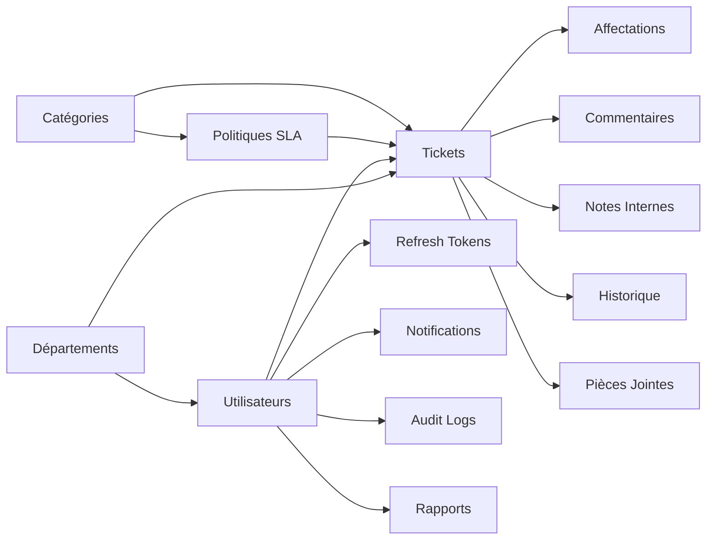

# 📡 Telecom Ticket Management — Backend API


Backend **NestJS** pour la plateforme de gestion des tickets d'incidents télécoms.
Utilisé par le Service Client, NOC, Facturation, Support Technique et Opérations Terrain.

---

## 📋 Table des matières

- [Prérequis](#-prérequis)
- [Démarrage Rapide](#-démarrage-rapide)
- [Comptes de Test](#-comptes-de-test-complet)
- [Architecture](#️-architecture)
- [Modules](#-modules-25)
- [Flux Asynchrone](#-flux-asynchrone-bullmq)
- [Sécurité](#️-sécurité)
- [Observabilité](#-observabilité)
- [Docker Compose](#-docker-compose-13-services)
- [Frontend (2 dépôts)](#-frontend-2-dépôts)
- [Scripts & Makefile](#-scripts--makefile)
- [Troubleshooting](#-troubleshooting)
- [Documentation](#-documentation)

---

## ✅ Prérequis

| Outil       | Version minimale | Vérification             |
| ----------- | ---------------- | ------------------------ |
| **Node.js** | ≥ 18.x           | `node -v`                |
| **pnpm**    | ≥ 8.x            | `pnpm -v`                |
| **Docker**  | ≥ 24.x           | `docker -v`              |
| **Compose** | ≥ 2.20           | `docker compose version` |

> ⚠️ **Toujours utiliser `pnpm`**, pas `npm` ni `yarn`.

---

## 🚀 Démarrage Rapide

### Étape 1 — Cloner et installer

```bash
git clone <url-du-repo>
cd Test-Backend-Telecom
pnpm install
```

### Étape 2 — Configurer l'environnement

```bash
# Copier le fichier d'exemple
cp .env.example .env

# Les valeurs par défaut fonctionnent immédiatement en local
# Aucune modification requise pour le développement
```

### Étape 3 — Démarrer les services Docker

```bash
# Services essentiels uniquement (PostgreSQL + Redis + Mailpit)
docker compose up -d postgres redis mailpit
```

### Étape 4 — Initialiser la base de données

```bash
# Pousser le schéma Drizzle + insérer les données de test
pnpm run db:push && pnpm run db:seed
```

### Étape 5 — Lancer l'API

```bash
pnpm run start:dev
```

✅ L'API est accessible sur `http://localhost:3000/api/v1`
✅ Swagger sur `http://localhost:3000/api/docs`

### Tests

```bash
# Tests unitaires (89 fichiers spec)
pnpm run test:unit

# Tests end-to-end (24 fichiers E2E/intégration)
pnpm run test:e2e

# Tous les tests (113 fichiers — comptage réel à exécuter)
pnpm run test:all
```

---

## 📊 Comptes de Test (complet)

> Tous les comptes sont créés par `pnpm run db:seed`. Mot de passe = colonne "Mot de passe".

### Administrateur

| Email                 | Nom           | Rôle          | Département    | Mot de passe |
| --------------------- | ------------- | ------------- | -------------- | ------------ |
| `admin@telecom.local` | Admin Système | ADMINISTRATOR | Administration | `Admin@1234` |

### Superviseurs

| Email                          | Nom            | Rôle       | Département   | Mot de passe |
| ------------------------------ | -------------- | ---------- | ------------- | ------------ |
| `supervisor@telecom.local`     | Sophie Laurent | SUPERVISOR | Customer Care | `Super@1234` |
| `supervisor-noc@telecom.local` | Marc Bernard   | SUPERVISOR | NOC           | `Super@1234` |

### Agents Customer Care

| Email                     | Nom           | Rôle                   | Département   | Mot de passe |
| ------------------------- | ------------- | ---------------------- | ------------- | ------------ |
| `agent-cc1@telecom.local` | Alice Dupont  | CUSTOMER_SERVICE_AGENT | Customer Care | `Agent@1234` |
| `agent-cc2@telecom.local` | Thomas Lebrun | CUSTOMER_SERVICE_AGENT | Customer Care | `Agent@1234` |

### Ingénieurs NOC

| Email                | Nom         | Rôle         | Département | Mot de passe |
| -------------------- | ----------- | ------------ | ----------- | ------------ |
| `noc1@telecom.local` | Bob Martin  | NOC_ENGINEER | NOC         | `Agent@1234` |
| `noc2@telecom.local` | Julie Simon | NOC_ENGINEER | NOC         | `Agent@1234` |

### Agents Facturation

| Email                    | Nom          | Rôle          | Département | Mot de passe |
| ------------------------ | ------------ | ------------- | ----------- | ------------ |
| `billing1@telecom.local` | Claire Petit | BILLING_AGENT | Billing     | `Agent@1234` |
| `billing2@telecom.local` | Luc Garnier  | BILLING_AGENT | Billing     | `Agent@1234` |

### Support Technique

| Email                 | Nom        | Rôle                       | Département       | Mot de passe |
| --------------------- | ---------- | -------------------------- | ----------------- | ------------ |
| `tech1@telecom.local` | David Roux | TECHNICAL_SUPPORT_ENGINEER | Technical Support | `Agent@1234` |
| `tech2@telecom.local` | Nina Morel | TECHNICAL_SUPPORT_ENGINEER | Technical Support | `Agent@1234` |
| `agent@telecom.local` | Test Agent | TECHNICAL_SUPPORT_ENGINEER | Technical Support | `Agent@1234` |

### Techniciens Terrain

| Email                  | Nom         | Rôle             | Département      | Mot de passe |
| ---------------------- | ----------- | ---------------- | ---------------- | ------------ |
| `field1@telecom.local` | Emma Moreau | FIELD_TECHNICIAN | Field Operations | `Agent@1234` |
| `field2@telecom.local` | Kevin Blanc | FIELD_TECHNICIAN | Field Operations | `Agent@1234` |

### Exemple de connexion via cURL

```bash
# Se connecter en tant qu'admin
curl -X POST http://localhost:3000/api/v1/auth/login \
  -H "Content-Type: application/json" \
  -d '{"email":"admin@telecom.local","password":"Admin@1234"}'

# Réponse :
# { "success": true, "data": { "accessToken": "...", "refreshToken": "...", "user": {...} } }

# Utiliser le token pour les requêtes authentifiées
curl http://localhost:3000/api/v1/users \
  -H "Authorization: Bearer <accessToken>"
```

### Comptes SSO Keycloak (après bascule `AUTH_PROVIDER=keycloak`)

> Keycloak tourne sur **http://localhost:8081** (8080 est utilisé par PhotoVault).
> Lancer `node keycloak/seed-users.mjs` (ou `make keycloak-seed`) pour créer les 105 comptes.

| Usage                             | Identifiant                                          | Mot de passe    |
| --------------------------------- | ---------------------------------------------------- | --------------- |
| Login SSO — Administrateur        | `admin@telecom.local`                                | `Admin@1234`    |
| Login SSO — Superviseur           | `supervisor@telecom.local`                           | `Super@1234`    |
| Login SSO — 105 agents seed       | `agent.<ROLE>.<1..15>@telecom.local` (7 rôles × 15)  | `Telecom@2026!` |
| Console admin Keycloak            | `admin` (définissable via `KEYCLOAK_ADMIN`)          | `Admin@1234`    |

Le formulaire de login est thématisé (Keycloakify v11) : `http://localhost:8081/realms/telecom/protocol/openid-connect/auth`.

### Outils de monitoring

| URL                                  | Service        | Identifiants         |
| ------------------------------------ | -------------- | -------------------- |
| `http://localhost:3000/api/v1`       | API REST       | Bearer token JWT     |
| `http://localhost:3000/api/docs`     | Swagger        | Aucun                |
| `http://localhost:3000/admin/queues` | BullBoard      | `admin`/`bullboard`  |
| `http://localhost:8025`              | Mailpit (mail) | Aucun                |
| `http://localhost:3001`              | Grafana        | `admin`/`admin`      |
| `http://localhost:8081/admin`        | Keycloak Admin | `admin`/`Admin@1234` |
| `http://localhost:9090`              | Prometheus     | Aucun                |
| `http://localhost:3002`              | Uptime Kuma    | Aucun (à configurer) |

---

## 🏗️ Architecture

```
25 modules NestJS · 31 tables PostgreSQL · 144 opérations OpenAPI · 8 workers BullMQ · 8 queues
```

### Schéma Entité-Relation (ERD Simplifié)



---

## 📦 Modules (25)

| Module           | Responsabilité                                                                               |
| ---------------- | -------------------------------------------------------------------------------------------- |
| `auth`           | JWT (access 15min + refresh 7j rotation), Argon2id, Redis JTI blacklist                      |
| `users`          | CRUD 7 rôles, activation/désactivation, mot de passe temporaire                              |
| `departments`    | 6 départements, soft delete                                                                  |
| `categories`     | Catégories de tickets avec `targetRole` dynamique pour auto-assignation                      |
| `tickets`        | State machine 9 statuts + 2 pending, ownership-based RBAC, INC-AAAA-NNNNNN, auto-clôture 48h |
| `comments`       | Commentaires publics (auteur/supervisor/admin)                                               |
| `internal-notes` | Notes internes (restriction FIELD_TECHNICIAN)                                                |
| `attachments`    | Upload/download streaming, interface abstraite IStorageService                               |
| `notifications`  | Inbox pattern, WebSocket temps réel                                                          |
| `sla`            | Politiques SLA, cron engine \*/5 min, breach/warning detection                               |
| `dashboard`      | 7 endpoints: overview, status, priority, departments, SLA, workload, resolution              |
| `audit-logs`     | Immutable write-only, recherche multi-filtres                                                |
| `email`          | Nodemailer dev/prod, 15 templates Handlebars + layout global unifié base.hbs                 |
| `reports`        | Génération PDF premium (PDFKit), rapports asynchrones, lien signé HMAC expirable             |
| `settings`       | Paramètres système globaux dynamiques (heures et jours ouvrables, limite de tickets actifs)  |
| `support-satisfaction` | Note 1-5, lien signé unique (TTL 14 j), email automatique à la clôture                 |
| `public-support` | Portail public : catalogue, conversations (draft → confirm), timeline, préférences           |
| `external-identity` | Identité publique : OTP email, appareils de confiance, assertions WordPress               |
| `support-integrations` | Tenants multi-sites : origines, routage, quotas, secrets chiffrés                        |
| `external-requesters` | Demandeurs publics : fusion de profils, anonymisation, rétention                          |
| `support-knowledge` | Base documentaire publique versionnée, cloisonnée par intégration                         |
| `support-bot`    | Assistant optionnel (budget, circuit breaker, outils fermés, repli formulaire)              |
| `outbox`         | Événements durables écrits dans la transaction métier, publication bornée                   |
| `external-delivery` | Livraisons sortantes : adaptateur email, statuts observables, rejeu                        |
| `app`            | Module racine, health checks, métriques Prometheus                                           |

---

## 🔄 Flux Asynchrone (BullMQ)

```
Ticket créé → TicketNotificationListener (@OnEvent)
  ├── EMAIL_QUEUE        → EmailWorker       → SMTP (confirmation, assignation, alerte)
  ├── NOTIFICATION_QUEUE → NotificationWorker → DB + WebSocket emit
  ├── AUDIT_QUEUE        → AuditWorker       → INSERT audit_logs
  └── SLA_QUEUE          → SlaWorker         → Vérification breach (delayed job)

Compte créé → UsersService
  └── EMAIL_QUEUE        → EmailWorker       → Email bienvenue + tempPassword

Mot de passe changé → AuthService
  └── EMAIL_QUEUE        → EmailWorker       → Email confirmation

ReportsController → REPORT_QUEUE → ReportWorker
  ├── NOTIFICATION_QUEUE → NotificationWorker → Notification in-app
  └── EMAIL_QUEUE        → EmailWorker       → Email avec résumé

SlaEngineService (@Cron */5 min)
  ├── DB update (slaBreached = true)
  ├── WebSocket emit (supervisor + assigné)
  ├── NOTIFICATION_QUEUE → NotificationWorker → DB + WebSocket
  └── EMAIL_QUEUE        → EmailWorker       → Alerte SLA

Événement outbox (support public) → OutboxPublisherService (@Interval 1 s)
  ├── external-delivery-queue → ExternalDeliveryWorker → EmailChannelAdapter (email demandeur)
  └── attachment-scan-queue → AttachmentScanWorker → ClamAV → promotion clean/
```

---

## 🛡️ Sécurité

- **Auth**: JWT access + refresh rotation SHA-256, Argon2id (memory 64MB, time 3, parallelism 4)
- **RBAC**: 7 rôles, `JwtAuthGuard` + `RolesGuard` + `@Roles()`
- **ABAC**: Cloisonnement départemental (agents/superviseurs voient uniquement leur département)
- **Rate Limiting**: Redis distribué (défauts 1000 req/15min, 20 login/heure/IP)
- **Idempotence**: `@Idempotent()` + header `Idempotency-Key` (table PostgreSQL, TTL 24h)
- **Soft Delete**: users, tickets, departments — aucune suppression physique

### Rôles et permissions (matrice RBAC)

| Action                    | Agent | NOC | Billing | Support | Field | Supervisor | Admin |
| ------------------------- | ----- | --- | ------- | ------- | ----- | ---------- | ----- |
| Créer ticket              | ✅    | ✅  | ✅      | ✅      | ✅    | ✅         | ✅    |
| Modifier ticket (assigné) | ✅    | ✅  | ✅      | ✅      | ✅    | ✅         | ✅    |
| Assigner/Réassigner       | ❌    | ❌  | ❌      | ❌      | ❌    | ✅         | ✅    |
| Résoudre ticket           | ✅    | ✅  | ✅      | ✅      | ✅    | ✅         | ✅    |
| Clôturer/Réouvrir         | ❌    | ❌  | ❌      | ❌      | ❌    | ✅         | ✅    |
| Notes internes            | ✅    | ✅  | ✅      | ✅      | ❌    | ✅         | ✅    |
| Audit logs                | ❌    | ❌  | ❌      | ❌      | ❌    | ✅         | ✅    |
| Gestion utilisateurs      | ❌    | ❌  | ❌      | ❌      | ❌    | Partiel    | ✅    |
| Gestion SLA               | ❌    | ❌  | ❌      | ❌      | ❌    | ✅         | ✅    |

---

## 📈 Observabilité

```
NestJS (Pino JSON)
  ├── Logs  → Promtail → Loki → Grafana
  ├── /metrics → Prometheus → Grafana → Alerting (Slack/Email)
  └── Traces → OpenTelemetry → Tempo → Grafana
```

**Métriques exposées**: HTTP requests, duration P95, tickets created, active, SLA breaches, DB pool, WebSocket connections, heap memory.

**6 règles d'alerte**: API down, erreurs 5xx, latence P95 > 2s, SLA breaches, DB connections > 15, heap > 90%.

---

## 🐳 Docker Compose (15 services)

```bash
# Services essentiels seulement
docker compose up -d postgres redis mailpit

# Tout démarrer (monitoring inclus)
make up-full

# Tout arrêter
make down
```

| Service       | Port       | Description               |
| ------------- | ---------- | ------------------------- |
| API NestJS    | 3000       | Backend REST API          |
| PostgreSQL 16 | 5432       | Base de données           |
| Redis 7       | 6379       | Cache + sessions + queues |
| Nginx         | 80, 443    | Reverse proxy             |
| Mailpit       | 1025, 8025 | SMTP de test (dev)        |
| Prometheus    | 9090       | Métriques                 |
| Grafana       | 3001       | Visualisation             |
| Loki          | 3100       | Agrégation logs           |
| Tempo         | 3200       | Tracing distribué         |
| Promtail      | 9080       | Collecteur logs           |
| Uptime Kuma   | 3002       | Monitoring uptime         |
| ClamAV        | 3310       | Antivirus des pièces jointes publiques |
| Keycloak      | 8081       | SSO Keycloak (8080 utilisé par PhotoVault) |

---

## 🖥️ Frontends (3 dépôts)

Ce projet dispose de **trois frontends** :

### 1. Frontend Embarqué (`./frontend/`)

Dépôt Git autonome à l'intérieur du backend. Architecture BFF (Backend-For-Frontend) avec cookies HttpOnly.

```bash
cd frontend
pnpm install
pnpm dev
```

- **Tech**: Next.js 16, React 19, TanStack Query, shadcn/ui, Socket.IO
- **Auth**: Cookies HttpOnly (pas de localStorage)
- **Port**: `http://localhost:3001` (par défaut)

### 2. Frontend Externe (`../Test frontend Telecom/`)

Dépôt Git séparé. Architecture SPA classique avec tokens en mémoire (Zustand).

```bash
cd "../Test frontend Telecom"
pnpm install
pnpm dev
```

- **Tech**: Next.js 16, React 19, TanStack Query, Radix UI, Tailwind CSS 4
- **Auth**: Bearer tokens en mémoire (Zustand store)
- **Port**: `http://localhost:3000` (changeable via `next dev -p 3001`)

> 📖 Voir le README du frontend externe pour la documentation complète.

### 3. Portail public + widget (`public-frontend/`)

Dépôt Git autonome (ignoré par le backend). Portail pleine page et widget iframe pour le support public.

```bash
cd public-frontend
pnpm install
pnpm dev
```

- **Auth**: BFF même origine, cookies HttpOnly publics + CSRF
- **Port**: `http://localhost:3005` (par défaut)

---

## 📋 Scripts & Makefile

### Scripts pnpm

| Commande                  | Description                       |
| ------------------------- | --------------------------------- |
| `pnpm run start:dev`      | Développement hot-reload          |
| `pnpm run build`          | Compilation TypeScript            |
| `pnpm run test`           | Tests unitaires (89 fichiers spec)|
| `pnpm run test:unit`      | Tests unitaires (chemin src/)     |
| `pnpm run test:e2e`       | Tests end-to-end (24 fichiers)    |
| `pnpm run test:all`       | Tous les tests (113 fichiers — comptage réel à exécuter) |
| `pnpm run test:cov`       | Tests avec couverture             |
| `pnpm run db:push`        | Pousser schéma Drizzle            |
| `pnpm run db:seed`        | Données de test (14 utilisateurs) |
| `pnpm run db:reset`       | db:push + db:seed                 |
| `pnpm run db:studio`      | Drizzle Studio (UI visuelle)      |
| `pnpm run openapi:export` | Exporter le schéma OpenAPI        |
| `pnpm run lint`           | ESLint                            |
| `pnpm run format`         | Prettier                          |

### Commandes Makefile

| Commande         | Description                              |
| ---------------- | ---------------------------------------- |
| `make help`      | Affiche toutes les commandes disponibles |
| `make up`        | Démarrer tous les services Docker        |
| `make down`      | Arrêter tous les services                |
| `make restart`   | Redémarrer                               |
| `make logs`      | Suivre les logs de l'API                 |
| `make ps`        | État des conteneurs                      |
| `make db-push`   | Pousser le schéma Drizzle                |
| `make db-seed`   | Insérer les données de test              |
| `make db-reset`  | Réinitialiser complètement la DB         |
| `make db-studio` | Drizzle Studio                           |
| `make dev`       | Lancer l'API en mode watch               |
| `make build`     | Compiler le projet                       |
| `make test`      | Lancer tous les tests                    |
| `make test-e2e`  | Tests end-to-end                         |
| `make lint`      | ESLint                                   |
| `make format`    | Prettier                                 |
| `make up-full`   | Tout démarrer avec monitoring            |
| `make clean`     | Nettoyer dist/ et coverage/              |

---

## 🔧 Troubleshooting

### L'API ne démarre pas

```bash
# 1. Vérifier que PostgreSQL et Redis sont démarrés
docker compose ps

# 2. Vérifier les ports occupés
# PostgreSQL doit être sur 5432, Redis sur 6379
netstat -an | findstr "5432 6379"

# 3. Réinitialiser complètement
make db-reset
```

### Erreur "Connection refused" à PostgreSQL

```bash
# PostgreSQL n'est pas démarré ou pas prêt
docker compose up -d postgres
# Attendre 5 secondes que le service soit prêt
timeout 5
pnpm run db:push
```

### Erreur 429 Too Many Requests (Rate Limiting)

```bash
# Flusher le cache Redis (dev uniquement)
docker compose exec redis redis-cli FLUSHALL
```

### Les emails n'arrivent pas

Vérifier que Mailpit est démarré et accessible :

```bash
docker compose up -d mailpit
# Ouvrir http://localhost:8025 dans le navigateur
```

### Réinitialiser tout depuis zéro

```bash
docker compose down -v     # Supprimer volumes
docker compose up -d postgres redis mailpit
timeout 5
pnpm run db:push
pnpm run db:seed
pnpm run start:dev
```

---

## 📚 Documentation

| Fichier                                                                          | Contenu                                           |
| -------------------------------------------------------------------------------- | ------------------------------------------------- |
| [CHANGELOG.md](CHANGELOG.md)                                                     | Historique complet des versions (v1.0.0 → 2026-08-12) |
| [CONTRIBUTING.md](CONTRIBUTING.md)                                               | Guide de contribution                             |
| [docs/quick-start.md](docs/quick-start.md)                                       | Guide de démarrage rapide (5 min)                 |
| [docs/routes.md](docs/routes.md)                                                 | Catalogue complet des 144 opérations API (généré depuis OpenAPI) |
| [docs/architecture-flows.md](docs/architecture-flows.md)                         | 10 diagrammes Mermaid                             |
| [docs/database-schema.md](docs/database-schema.md)                               | Schéma de base de données (31 tables)             |
| [docs/ticket-lifecycle.md](docs/ticket-lifecycle.md)                             | Machine à états des tickets (9 statuts)           |
| [docs/domain-events.md](docs/domain-events.md)                                   | Événements domaine EventEmitter2                  |
| [docs/security.md](docs/security.md)                                             | Guide de sécurité (auth, RBAC, rate limiting)     |
| [docs/test-accounts.md](docs/test-accounts.md)                                   | Comptes de test et identifiants                   |
| [docs/testing.md](docs/testing.md)                                               | Guide des tests (89 spec + 24 E2E/intégration)    |
| [docs/environment-variables.md](docs/environment-variables.md)                   | Référence variables d'env                         |
| [docs/deployment.md](docs/deployment.md)                                         | Guide de déploiement production                   |
| [docs/emails.md](docs/emails.md)                                                 | Architecture email, templates, flux               |
| [docs/observability.md](docs/observability.md)                                   | Prometheus, Loki, Tempo, Grafana, alertes         |
| [docs/websockets.md](docs/websockets.md)                                         | WebSocket temps réel, rooms, scaling              |
| [docs/jobs-and-workers.md](docs/jobs-and-workers.md)                             | Architecture BullMQ et 8 workers                  |
| [docs/workers.md](docs/workers.md)                                               | Détail des 8 workers BullMQ                       |
| [docs/troubleshooting.md](docs/troubleshooting.md)                               | Résolution des erreurs courantes                  |
| [docs/implementation-status.md](docs/implementation-status.md)                   | État production-readiness                         |
| [docs/detailed-design-assignment-sla.md](docs/detailed-design-assignment-sla.md) | Choix d'archi SLA & Auto-Assignation              |
| [.env.example](.env.example)                                                     | 143 variables d'environnement documentées         |
