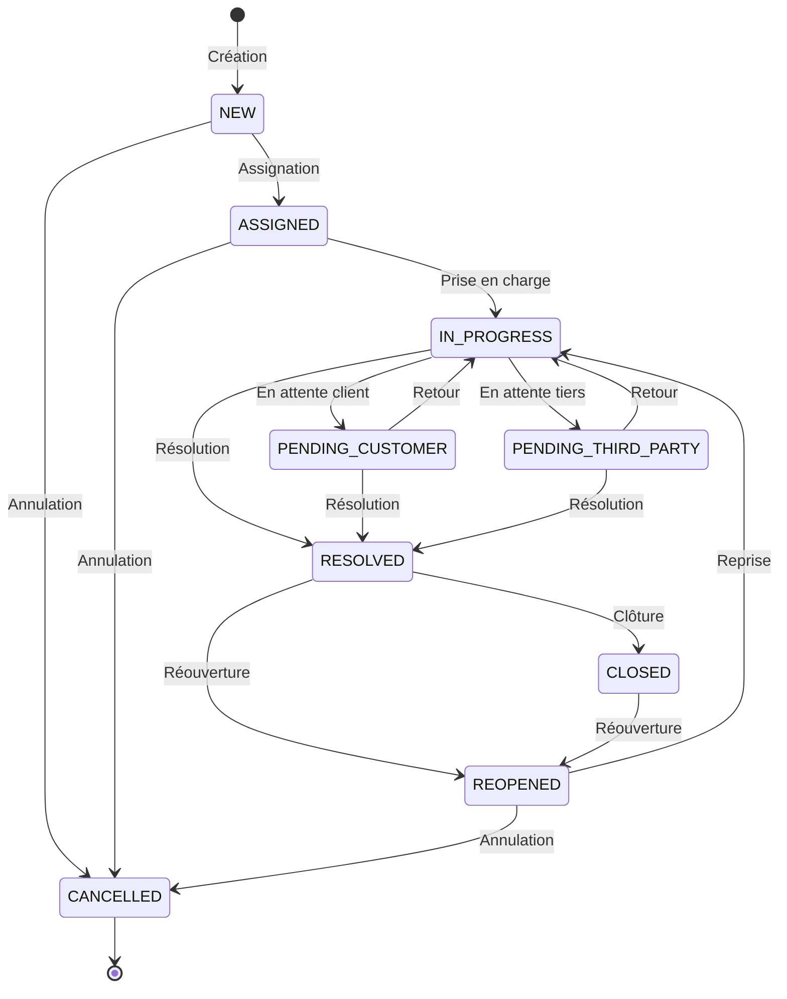
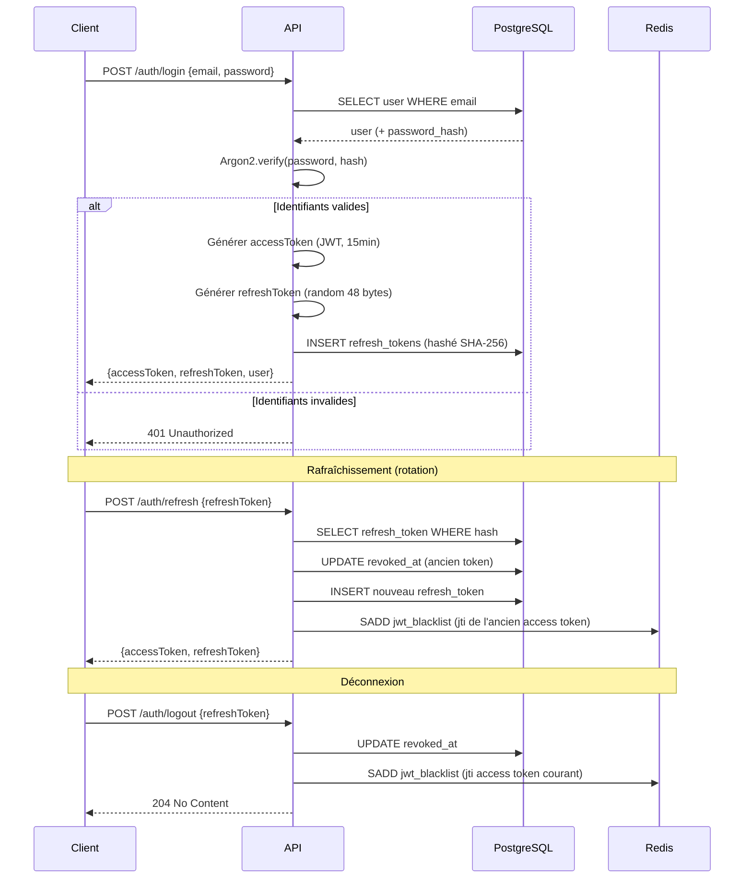
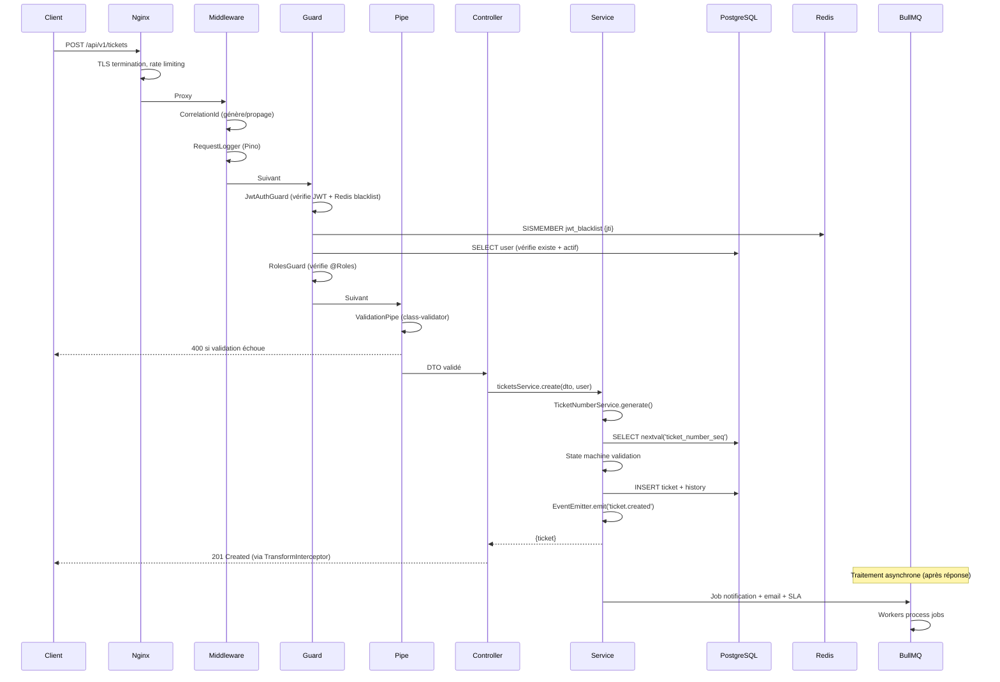
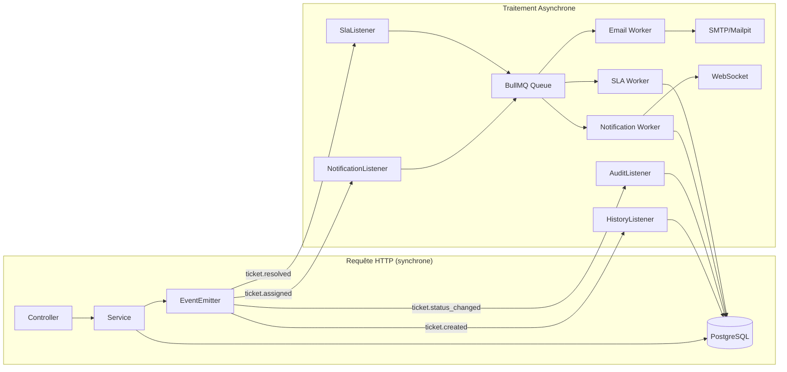
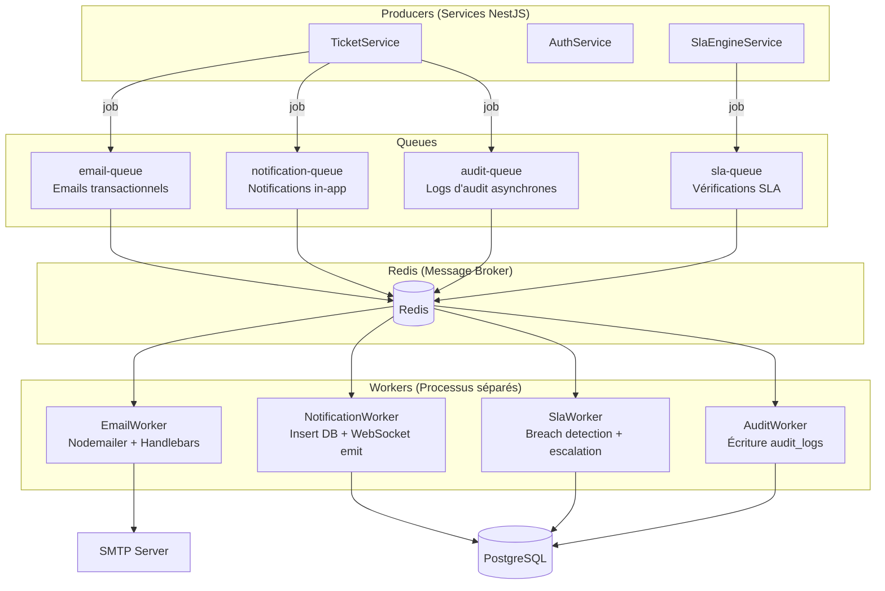
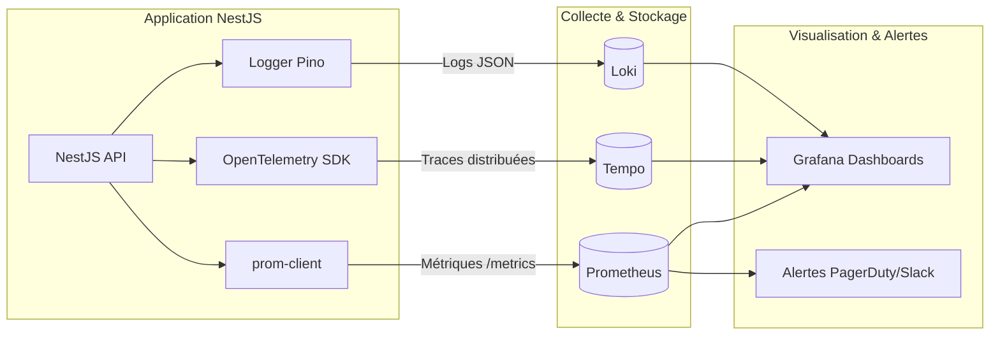
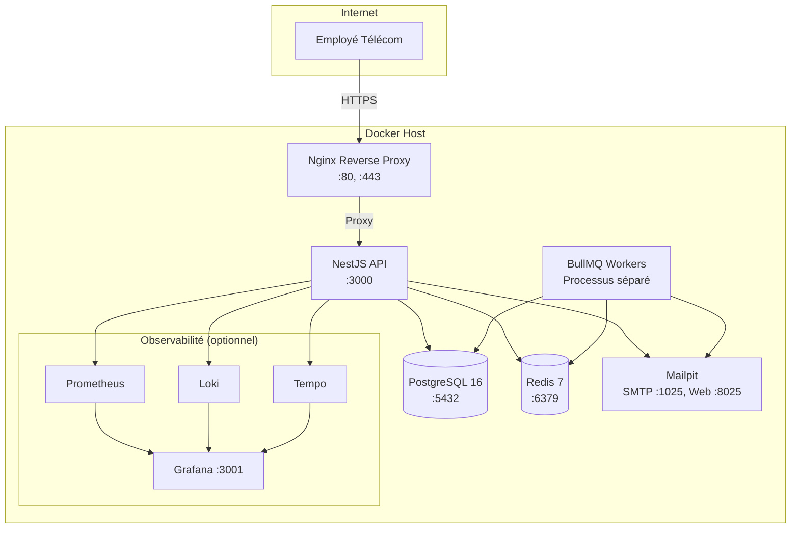
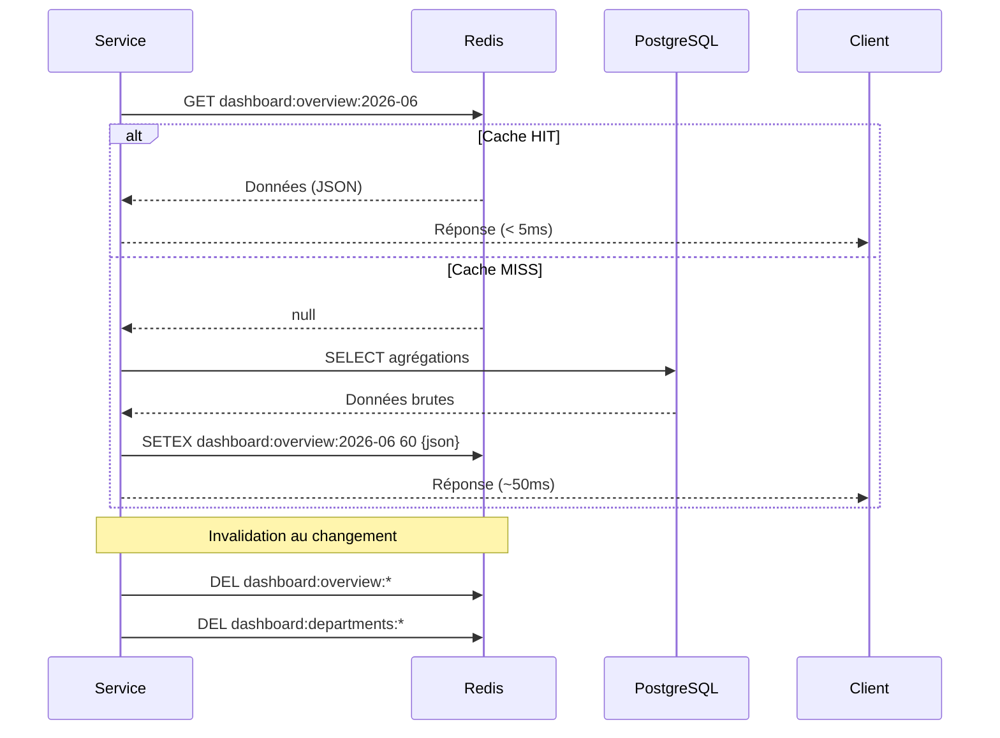

# Flux Architecturaux — Diagrammes Mermaid

## 1. Cycle de Vie d'un Ticket



## 2. Flux d'Authentification JWT avec Rotation



## 3. Pipeline Requête HTTP (Request Lifecycle)



## 4. Traitement Asynchrone — Domain Events → BullMQ



## 5. Architecture des Files BullMQ



## 6. Stack d'Observabilité



## 7. Déploiement Docker Compose (Vue C4 — Niveau Conteneurs)



## 8. RBAC — Flux de Décision d'Autorisation

```mermaid
flowchart TD
    Request[Requête HTTP] --> JWTGuard{JwtAuthGuard}
    JWTGuard -->|Token absent/invalide| Reject1[401 Unauthorized]
    JWTGuard -->|Token valide| RedisCheck{JTI dans<br/>blacklist Redis?}
    RedisCheck -->|Oui| Reject2[401 Token révoqué]
    RedisCheck -->|Non| UserCheck{Utilisateur<br/>existe + actif?}
    UserCheck -->|Non| Reject3[401 Désactivé]
    UserCheck -->|Oui| RolesGuard{RolesGuard}

    RolesGuard -->|Pas de @Roles| Pass[Accès autorisé]
    RolesGuard -->|@Roles requis| RoleCheck{Rôle dans<br/>la liste?}
    RoleCheck -->|Oui| Pass
    RoleCheck -->|Non| Reject4[403 Forbidden]

    Pass --> Controller[Controller]
```

## 9. Cache Redis — Stratégie Cache-Aside


