# Flux Architecturaux & Séquences Techniques — Diagrammes Mermaid Enrichis

> Ce document regroupe les 14 diagrammes Mermaid officiels décrivant l'intégralité des flux du système : authentification SSO Keycloak, portail public multicanal, assertions WordPress, pipeline HTTP, outbox durable, quarantaine antivirus ClamAV, bot conversationnel avec coupe-circuit, architecture des 8 workers BullMQ et observabilité.

---

## 1. Cycle de Vie d'un Ticket (Machine à 9 Statuts + 2 Attentes)

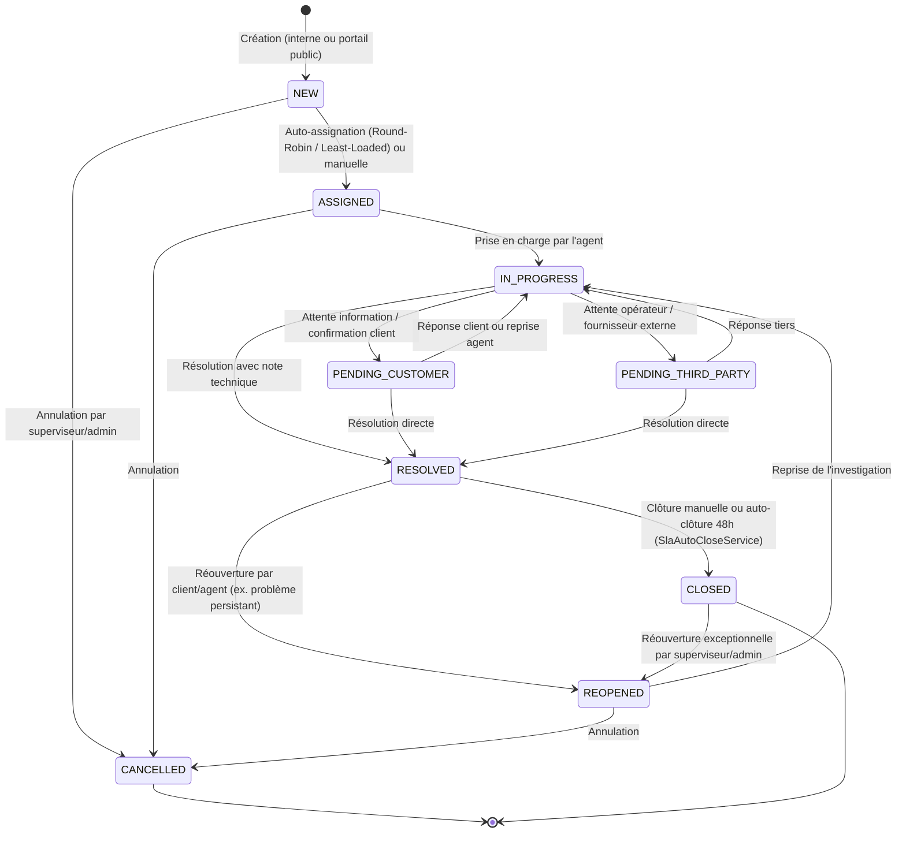
```mermaid
stateDiagram-v2
    [*] --> NEW : Création (interne ou portail public)
    NEW --> ASSIGNED : Auto-assignation (Round-Robin / Least-Loaded) ou manuelle
    NEW --> CANCELLED : Annulation par superviseur/admin
    ASSIGNED --> IN_PROGRESS : Prise en charge par l'agent
    ASSIGNED --> CANCELLED : Annulation
    IN_PROGRESS --> PENDING_CUSTOMER : Attente information / confirmation client
    IN_PROGRESS --> PENDING_THIRD_PARTY : Attente opérateur / fournisseur externe
    IN_PROGRESS --> RESOLVED : Résolution avec note technique
    PENDING_CUSTOMER --> IN_PROGRESS : Réponse client ou reprise agent
    PENDING_CUSTOMER --> RESOLVED : Résolution directe
    PENDING_THIRD_PARTY --> IN_PROGRESS : Réponse tiers
    PENDING_THIRD_PARTY --> RESOLVED : Résolution directe
    RESOLVED --> CLOSED : Clôture manuelle ou auto-clôture 48h (SlaAutoCloseService)
    RESOLVED --> REOPENED : Réouverture par client/agent (ex. problème persistant)
    CLOSED --> REOPENED : Réouverture exceptionnelle par superviseur/admin
    REOPENED --> IN_PROGRESS : Reprise de l'investigation
    REOPENED --> CANCELLED : Annulation
    CANCELLED --> [*]
    CLOSED --> [*]
```

---

## 2. Flux d'Authentification Keycloak SSO Unique (OIDC PKCE + JWKS)

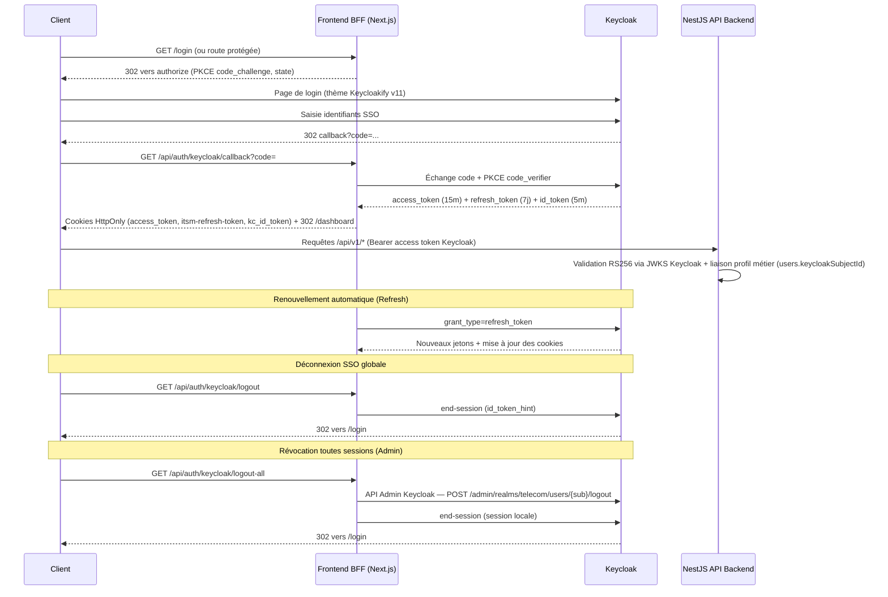
```mermaid
sequenceDiagram
    participant Client
    participant BFF as Frontend BFF (Next.js)
    participant Keycloak
    participant API as NestJS API Backend

    Client->>BFF: GET /login (ou route protégée)
    BFF-->>Client: 302 vers authorize (PKCE code_challenge, state)
    Client->>Keycloak: Page de login (thème Keycloakify v11)
    Client->>Keycloak: Saisie identifiants SSO
    Keycloak-->>Client: 302 callback?code=...
    Client->>BFF: GET /api/auth/keycloak/callback?code=
    BFF->>Keycloak: Échange code + PKCE code_verifier
    Keycloak-->>BFF: access_token (15m) + refresh_token (7j) + id_token (5m)
    BFF-->>Client: Cookies HttpOnly (access_token, itsm-refresh-token, kc_id_token) + 302 /dashboard
    Client->>API: Requêtes /api/v1/* (Bearer access token Keycloak)
    API->>API: Validation RS256 via JWKS Keycloak + liaison profil métier (users.keycloakSubjectId)

    Note over Client,Keycloak: Renouvellement automatique (Refresh)
    BFF->>Keycloak: grant_type=refresh_token
    Keycloak-->>BFF: Nouveaux jetons + mise à jour des cookies

    Note over Client,Keycloak: Déconnexion SSO globale
    Client->>BFF: GET /api/auth/keycloak/logout
    BFF->>Keycloak: end-session (id_token_hint)
    Keycloak-->>Client: 302 vers /login

    Note over Client,Keycloak: Révocation toutes sessions (Admin)
    Client->>BFF: GET /api/auth/keycloak/logout-all
    BFF->>Keycloak: API Admin Keycloak — POST /admin/realms/telecom/users/{sub}/logout
    BFF->>Keycloak: end-session (session locale)
    Keycloak-->>Client: 302 vers /login
```

---

## 3. Portail Support Public & Widget (Admission, OTP & Session Appareil)

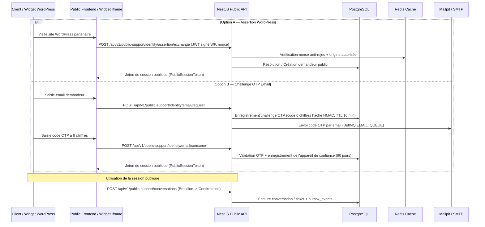
```mermaid
sequenceDiagram
    participant Visitor as Client / Widget WordPress
    participant Widget as Public Frontend / Widget Iframe
    participant API as NestJS Public API
    participant DB as PostgreSQL
    participant Redis as Redis Cache
    participant Mail as Mailpit / SMTP

    alt Option A — Assertion WordPress
        Visitor->>Widget: Visite site WordPress partenaire
        Widget->>API: POST /api/v1/public-support/identity/assertion/exchange (JWT signé WP, nonce)
        API->>Redis: Verification nonce anti-rejeu + origine autorisée
        API->>DB: Résolution / Création demandeur public
        API-->>Widget: Jeton de session publique (PublicSessionToken)
    else Option B — Challenge OTP Email
        Visitor->>Widget: Saisie email demandeur
        Widget->>API: POST /api/v1/public-support/identity/email/request
        API->>DB: Enregistrement challenge OTP (code 6 chiffres haché HMAC, TTL 10 min)
        API->>Mail: Envoi code OTP par email (BullMQ EMAIL_QUEUE)
        Visitor->>Widget: Saisie code OTP à 6 chiffres
        Widget->>API: POST /api/v1/public-support/identity/email/consume
        API->>DB: Validation OTP + enregistrement de l'appareil de confiance (90 jours)
        API-->>Widget: Jeton de session publique (PublicSessionToken)
    end

    Note over Visitor,API: Utilisation de la session publique
    Widget->>API: POST /api/v1/public-support/conversations (Brouillon -> Confirmation)
    API->>DB: Écriture conversation / ticket + outbox_events
```

---

## 4. Pipeline Requête HTTP (Guards, Validation & Intercepteurs)

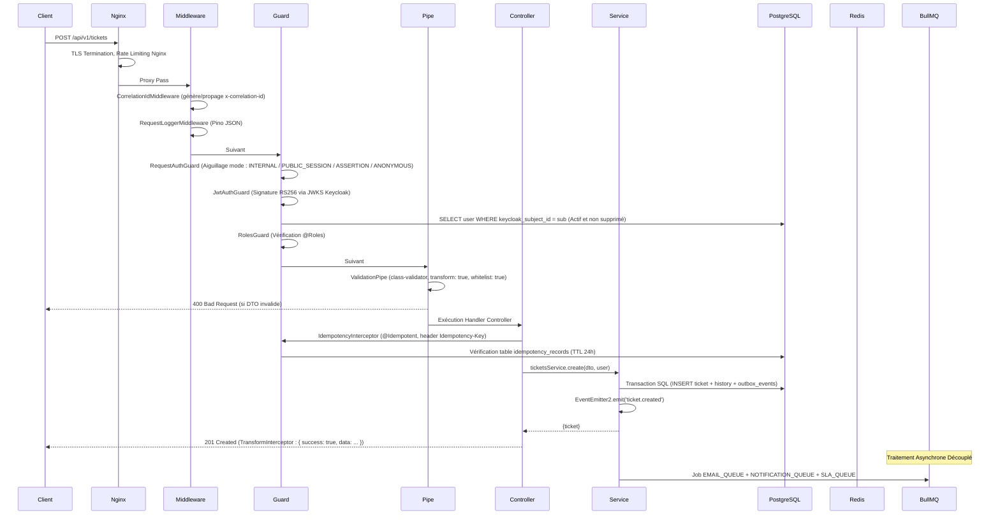
```mermaid
sequenceDiagram
    participant Client
    participant Nginx
    participant Middleware
    participant Guard
    participant Pipe
    participant Controller
    participant Service
    participant DB as PostgreSQL
    participant Redis
    participant BullMQ

    Client->>Nginx: POST /api/v1/tickets
    Nginx->>Nginx: TLS Termination, Rate Limiting Nginx
    Nginx->>Middleware: Proxy Pass

    Middleware->>Middleware: CorrelationIdMiddleware (génère/propage x-correlation-id)
    Middleware->>Middleware: RequestLoggerMiddleware (Pino JSON)

    Middleware->>Guard: Suivant

    Guard->>Guard: RequestAuthGuard (Aiguillage mode : INTERNAL / PUBLIC_SESSION / ASSERTION / ANONYMOUS)
    Guard->>Guard: JwtAuthGuard (Signature RS256 via JWKS Keycloak)
    Guard->>DB: SELECT user WHERE keycloak_subject_id = sub (Actif et non supprimé)
    Guard->>Guard: RolesGuard (Vérification @Roles)

    Guard->>Pipe: Suivant
    Pipe->>Pipe: ValidationPipe (class-validator, transform: true, whitelist: true)
    Pipe-->>Client: 400 Bad Request (si DTO invalide)

    Pipe->>Controller: Exécution Handler Controller
    Controller->>Guard: IdempotencyInterceptor (@Idempotent, header Idempotency-Key)
    Guard->>DB: Vérification table idempotency_records (TTL 24h)
    Controller->>Service: ticketsService.create(dto, user)

    Service->>DB: Transaction SQL (INSERT ticket + history + outbox_events)
    Service->>Service: EventEmitter2.emit('ticket.created')
    Service-->>Controller: {ticket}

    Controller-->>Client: 201 Created (TransformInterceptor : { success: true, data: ... })

    Note over BullMQ: Traitement Asynchrone Découplé
    Service->>BullMQ: Job EMAIL_QUEUE + NOTIFICATION_QUEUE + SLA_QUEUE
```

---

## 5. Moteur Outbox & Livraisons Sortantes Fiables

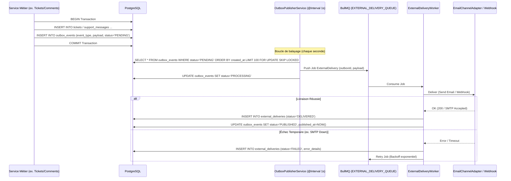
```mermaid
sequenceDiagram
    participant Domain as Service Métier (ex. Tickets/Comments)
    participant DB as PostgreSQL
    participant OutboxPub as OutboxPublisherService (@Interval 1s)
    participant Queue as BullMQ (EXTERNAL_DELIVERY_QUEUE)
    participant Worker as ExternalDeliveryWorker
    participant Adapter as EmailChannelAdapter / Webhook

    Domain->>DB: BEGIN Transaction
    Domain->>DB: INSERT INTO tickets / support_messages ...
    Domain->>DB: INSERT INTO outbox_events (event_type, payload, status='PENDING')
    Domain->>DB: COMMIT Transaction

    Note over OutboxPub: Boucle de balayage (chaque seconde)
    OutboxPub->>DB: SELECT * FROM outbox_events WHERE status='PENDING' ORDER BY created_at LIMIT 100 FOR UPDATE SKIP LOCKED
    OutboxPub->>Queue: Push Job ExternalDelivery (outboxId, payload)
    OutboxPub->>DB: UPDATE outbox_events SET status='PROCESSING'

    Queue->>Worker: Consume Job
    Worker->>Adapter: Deliver (Send Email / Webhook)
    alt Livraison Réussie
        Adapter-->>Worker: OK (200 / SMTP Accepted)
        Worker->>DB: INSERT INTO external_deliveries (status='DELIVERED')
        Worker->>DB: UPDATE outbox_events SET status='PUBLISHED', published_at=NOW()
    else Échec Temporaire (ex. SMTP Down)
        Adapter-->>Worker: Error / Timeout
        Worker->>DB: INSERT INTO external_deliveries (status='FAILED', error_details)
        Worker->>Queue: Retry Job (Backoff exponentiel)
    end
```

---

## 6. Pipeline Pièces Jointes & Quarantaine Antivirus ClamAV

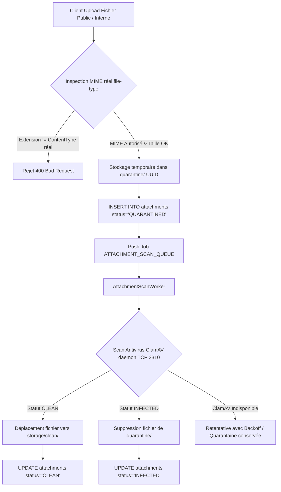
```mermaid
flowchart TD
    A[Client Upload Fichier Public / Interne] --> B{Inspection MIME réel file-type}
    B -->|Extension != ContentType réel| C[Rejet 400 Bad Request]
    B -->|MIME Autorisé & Taille OK| D[Stockage temporaire dans quarantine/ UUID]
    D --> E[INSERT INTO attachments status='QUARANTINED']
    E --> F[Push Job ATTACHMENT_SCAN_QUEUE]
    F --> G[AttachmentScanWorker]
    G --> H{Scan Antivirus ClamAV daemon TCP 3310}
    H -->|Statut CLEAN| I[Déplacement fichier vers storage/clean/]
    I --> J[UPDATE attachments status='CLEAN']
    H -->|Statut INFECTED| K[Suppression fichier de quarantine/]
    K --> L[UPDATE attachments status='INFECTED']
    H -->|ClamAV Indisponible| M[Retentative avec Backoff / Quarantaine conservée]
```

---

## 7. Assistant Conversationnel Support Bot (Budget, Circuit Breaker & Fallback)

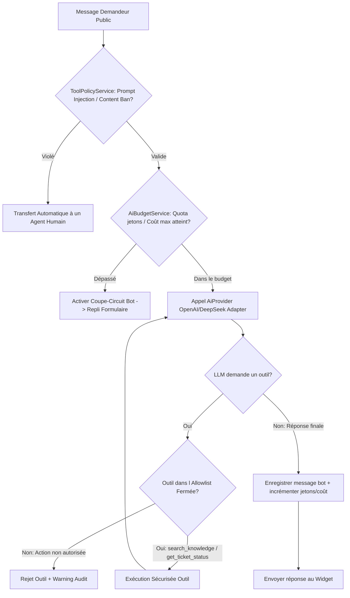
```mermaid
flowchart TD
    MessageIn[Message Demandeur Public] --> PolicyCheck{ToolPolicyService: Prompt Injection / Content Ban?}
    PolicyCheck -->|Violé| FallbackHuman[Transfert Automatique à un Agent Humain]
    PolicyCheck -->|Valide| BudgetCheck{AiBudgetService: Quota jetons / Coût max atteint?}
    BudgetCheck -->|Dépassé| CircuitBreaker[Activer Coupe-Circuit Bot -> Repli Formulaire]
    BudgetCheck -->|Dans le budget| ProviderCall[Appel AiProvider OpenAI/DeepSeek Adapter]
    ProviderCall --> ToolCall{LLM demande un outil?}
    ToolCall -->|Oui| AllowlistCheck{Outil dans l Allowlist Fermée?}
    AllowlistCheck -->|Oui: search_knowledge / get_ticket_status| ExecTool[Exécution Sécurisée Outil]
    AllowlistCheck -->|Non: Action non autorisée| BlockTool[Rejet Outil + Warning Audit]
    ExecTool --> ProviderCall
    ToolCall -->|Non: Réponse finale| SaveMsg[Enregistrer message bot + incrémenter jetons/coût]
    SaveMsg --> Out[Envoyer réponse au Widget]
```

---

## 8. Architecture des 8 Files & Workers BullMQ

```mermaid
flowchart TB
    subgraph Producteurs
        TicketService[TicketService]
        AuthService[AuthService]
        SlaEngine[SlaEngineService]
        AttachmentService[AttachmentUploadService]
        OutboxPub[OutboxPublisherService]
        ReportService[ReportQueryService]
    end

    subgraph Redis
        Redis[(Redis 7)]
    end

    subgraph Files
        Q1[email-queue]
        Q2[notification-queue]
        Q3[sla-queue]
        Q4[audit-queue]
        Q5[assignment-queue]
        Q6[external-delivery-queue]
        Q7[attachment-scan-queue]
        Q8[report-queue]
    end

    subgraph Workers
        W1[EmailWorker]
        W2[NotificationWorker]
        W3[SlaWorker]
        W4[AuditWorker]
        W5[AssignmentWorker]
        W6[ExternalDeliveryWorker]
        W7[AttachmentScanWorker]
        W8[ReportWorker]
    end

    TicketService --> Q1 & Q2 & Q4
    AuthService --> Q1
    SlaEngine --> Q3
    AttachmentService --> Q7
    OutboxPub --> Q6
    ReportService --> Q8

    Q1 & Q2 & Q3 & Q4 & Q5 & Q6 & Q7 & Q8 --> Redis

    Redis --> W1 & W2 & W3 & W4 & W5 & W6 & W7 & W8

    W1 --> SMTP[SMTP Mailpit]
    W2 --> DB[(PostgreSQL)] & WS[WebSocket /ws]
    W3 --> DB & WS
    W4 --> DB
    W5 --> DB
    W6 --> SMTP
    W7 --> ClamAV[ClamAV TCP 3310]
    W8 --> PDFKit[Génération PDFKit]
```

---

## 9. Stack d'Observabilité Globale (Logs, Traces & Métriques)

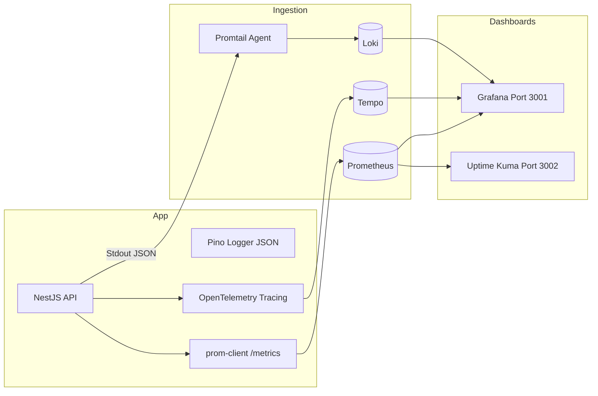
```mermaid
flowchart LR
    subgraph App
        API[NestJS API]
        Pino[Pino Logger JSON]
        OTel[OpenTelemetry Tracing]
        PromClient[prom-client /metrics]
    end

    subgraph Ingestion
        Promtail[Promtail Agent]
        Loki[(Loki)]
        Tempo[(Tempo)]
        Prometheus[(Prometheus)]
    end

    subgraph Dashboards
        Grafana[Grafana Port 3001]
        Kuma[Uptime Kuma Port 3002]
    end

    API -->|Stdout JSON| Promtail
    Promtail --> Loki
    API --> OTel
    API --> PromClient

    OTel --> Tempo
    PromClient --> Prometheus

    Loki --> Grafana
    Tempo --> Grafana
    Prometheus --> Grafana
    Prometheus --> Kuma
```

---

## 10. Déploiement Docker Compose (15 Services en Conteneurs)

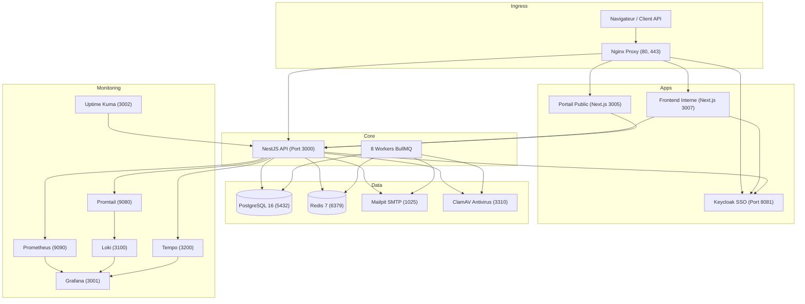
```mermaid
flowchart TB

    subgraph Ingress
        User[Navigateur / Client API]
        Nginx["Nginx Proxy (80, 443)"]
    end

    subgraph Apps
        BFF["Frontend Interne (Next.js 3007)"]
        PublicFE["Portail Public (Next.js 3005)"]
        KC["Keycloak SSO (Port 8081)"]
    end

    subgraph Core
        API["NestJS API (Port 3000)"]
        Workers["8 Workers BullMQ"]
    end

    subgraph Data
        PG[("PostgreSQL 16 (5432)")]
        RD[("Redis 7 (6379)")]
        Mailpit["Mailpit SMTP (1025)"]
        ClamAV["ClamAV Antivirus (3310)"]
    end

    subgraph Monitoring
        Prom["Prometheus (9090)"]
        LokiS["Loki (3100)"]
        TempoS["Tempo (3200)"]
        PromtailS["Promtail (9080)"]
        Graf["Grafana (3001)"]
        Kuma["Uptime Kuma (3002)"]
    end

    User --> Nginx
    Nginx --> BFF & PublicFE & API & KC
    BFF & PublicFE --> API
    BFF & API --> KC
    API & Workers --> PG & RD & Mailpit & ClamAV
    API --> PromtailS & Prom & TempoS
    PromtailS --> LokiS
    Prom & LokiS & TempoS --> Graf
    Kuma --> API
```

---

## 11. RBAC & ABAC — Arbre de Décision des Permissions

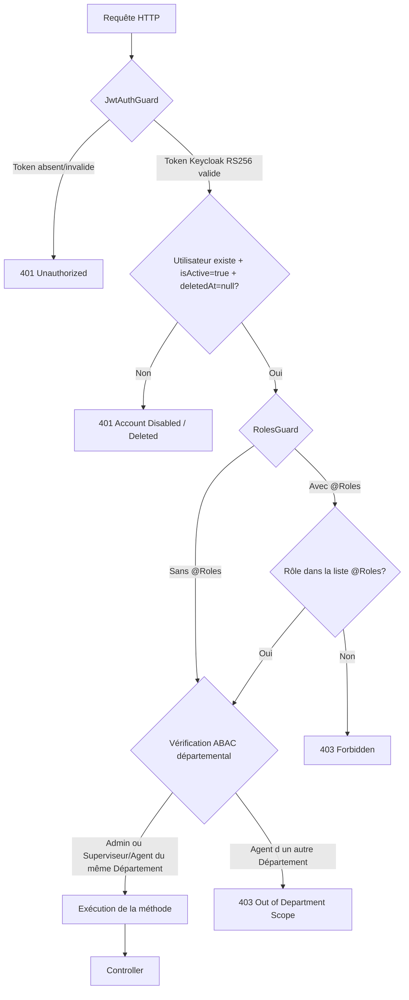
```mermaid
flowchart TD
    Request[Requête HTTP] --> JWTGuard{JwtAuthGuard}
    JWTGuard -->|Token absent/invalide| Reject1[401 Unauthorized]
    JWTGuard -->|Token Keycloak RS256 valide| UserCheck{Utilisateur existe + isActive=true + deletedAt=null?}
    UserCheck -->|Non| Reject3[401 Account Disabled / Deleted]
    UserCheck -->|Oui| RolesGuard{RolesGuard}

    RolesGuard -->|"Sans @Roles"| ABACCheck{Vérification ABAC départemental}
    RolesGuard -->|"Avec @Roles"| RoleCheck{Rôle dans la liste @Roles?}
    RoleCheck -->|Oui| ABACCheck
    RoleCheck -->|Non| Reject4[403 Forbidden]

    ABACCheck -->|Admin ou Superviseur/Agent du même Département| Pass[Exécution de la méthode]
    ABACCheck -->|Agent d un autre Département| Reject5[403 Out of Department Scope]
    Pass --> Controller[Controller]
```

---

## 12. Cache Redis — Stratégie Cache-Aside avec Invalidation

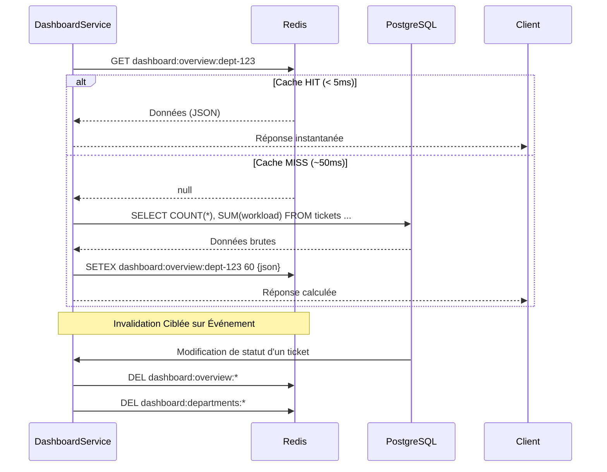
```mermaid
sequenceDiagram
    participant Service as DashboardService
    participant Redis
    participant PostgreSQL

    Service->>Redis: GET dashboard:overview:dept-123
    alt Cache HIT (< 5ms)
        Redis-->>Service: Données (JSON)
        Service-->>Client: Réponse instantanée
    else Cache MISS (~50ms)
        Redis-->>Service: null
        Service->>PostgreSQL: SELECT COUNT(*), SUM(workload) FROM tickets ...
        PostgreSQL-->>Service: Données brutes
        Service->>Redis: SETEX dashboard:overview:dept-123 60 {json}
        Service-->>Client: Réponse calculée
    end

    Note over Service,Redis: Invalidation Ciblée sur Événement
    PostgreSQL->>Service: Modification de statut d'un ticket
    Service->>Redis: DEL dashboard:overview:*
    Service->>Redis: DEL dashboard:departments:*
```

---

## 13. Moteur d'Auto-Assignation avec Vue Matérialisée Workload

```mermaid
flowchart TD
    Start[Ticket Créé / Non Assigné] --> CatLookup[Lecture Catégorie -> targetRole]
    CatLookup --> ActiveAgents[Agents actifs du département]
    ActiveAgents --> FilterRole{Possède targetRole & IsAvailable=true & NotOnLeave?}
    FilterRole -->|Oui| FilterCapacity{ticketsActifs < maxConcurrentTickets?}
    FilterRole -->|Non| ExcludeAgent[Exclure l Agent]
    FilterCapacity -->|Oui| QueryMV[Consulter materialized_workload_view]
    FilterCapacity -->|Non| ExcludeAgent
    QueryMV --> Strategy{Stratégie du Département}
    Strategy -->|LEAST_LOADED (NOC)| SortScore[Agent avec le plus faible workload_score]
    Strategy -->|ROUND_ROBIN| SortRR[Prochain Agent selon l index séquentiel]
    SortScore & SortRR --> Assign[UPDATE tickets SET assigned_to = agentId]
    Assign --> Event[Emit ticket.assigned -> Event & Notification Worker]
```

---

## 14. Flux Détection & Escroquerie SLA (Breach / Warning Cron)

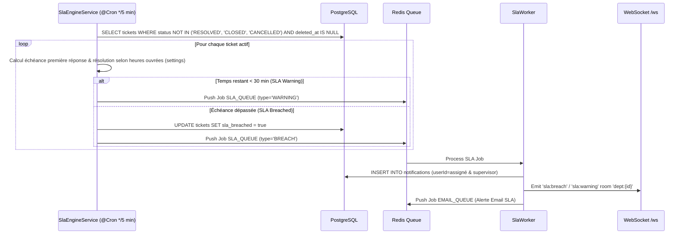
```mermaid
sequenceDiagram
    participant Cron as SlaEngineService (@Cron */5 min)
    participant DB as PostgreSQL
    participant Redis as Redis Queue
    participant Worker as SlaWorker
    participant WS as WebSocket /ws

    Cron->>DB: SELECT tickets WHERE status NOT IN ('RESOLVED', 'CLOSED', 'CANCELLED') AND deleted_at IS NULL
    loop Pour chaque ticket actif
        Cron->>Cron: Calcul échéance première réponse & résolution selon heures ouvrées (settings)
        alt Temps restant < 30 min (SLA Warning)
            Cron->>Redis: Push Job SLA_QUEUE (type='WARNING')
        else Échéance dépassée (SLA Breached)
            Cron->>DB: UPDATE tickets SET sla_breached = true
            Cron->>Redis: Push Job SLA_QUEUE (type='BREACH')
        end
    end

    Redis->>Worker: Process SLA Job
    Worker->>DB: INSERT INTO notifications (userId=assigné & supervisor)
    Worker->>WS: Emit 'sla:breach' / 'sla:warning' room 'dept:{id}'
    Worker->>Redis: Push Job EMAIL_QUEUE (Alerte Email SLA)
```
